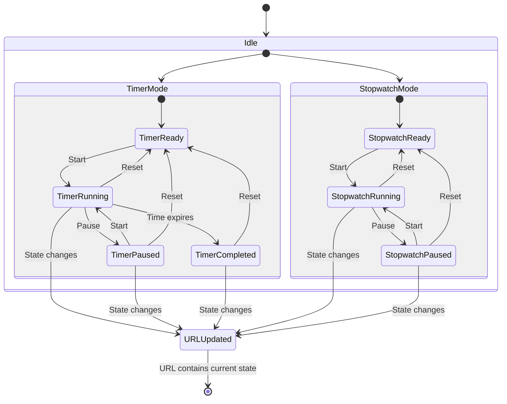

```mermaid
stateDiagram-v2
    [*] --> Idle

    state Idle {
        [*] --> TimerMode
        [*] --> StopwatchMode
        
        state TimerMode {
            [*] --> TimerReady
            TimerReady --> TimerRunning: Start
            TimerRunning --> TimerPaused: Pause
            TimerPaused --> TimerRunning: Start
            TimerRunning --> TimerReady: Reset
            TimerPaused --> TimerReady: Reset
            TimerRunning --> TimerCompleted: Time expires
            TimerCompleted --> TimerReady: Reset
        }

        state StopwatchMode {
            [*] --> StopwatchReady
            StopwatchReady --> StopwatchRunning: Start
            StopwatchRunning --> StopwatchPaused: Pause
            StopwatchPaused --> StopwatchRunning: Start
            StopwatchRunning --> StopwatchReady: Reset
            StopwatchPaused --> StopwatchReady: Reset
        }
    }

    TimerRunning --> URLUpdated: State changes
    TimerPaused --> URLUpdated: State changes
    TimerCompleted --> URLUpdated: State changes
    StopwatchRunning --> URLUpdated: State changes
    StopwatchPaused --> URLUpdated: State changes

    URLUpdated --> [*]: URL contains current state
```
